# Employee Turnover Analytics using Machine Learning


## Overview

This project focuses on predicting employee turnover using machine learning and translating those predictions into actionable business insights. It demonstrates an end-to-end ML workflow from data analysis to model evaluation and strategic recommendations.

## Business Problem

Employee attrition is costly. This project analyzes employee data to identify patterns that lead to turnover and helps organizations proactively retain talent.

## Project Objectives

- Analyze employee behavior and attrition patterns
- Perform exploratory data analysis (EDA)
- Apply clustering techniques (KMeans)
- Handle class imbalance using SMOTE
- Train and evaluate multiple machine learning models
- Provide data-driven retention strategies

## Tools and Technologies

- Python
- Pandas
- NumPy
- Matplotlib / Seaborn
- Scikit-learn
- SMOTE (imbalanced-learn)

## Machine Learning Workflow

```text
Data Loading → Data Cleaning → EDA → Feature Engineering → Clustering → SMOTE → Model Training → Evaluation → Business Insights
```

## Step-by-Step Walkthrough

### 1. Project Files
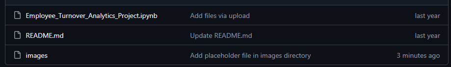

### 2. Imports and ML Libraries
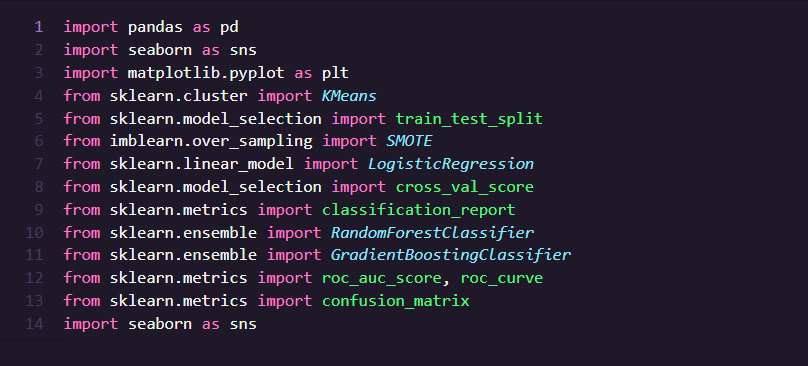

### 3. Dataset Preview
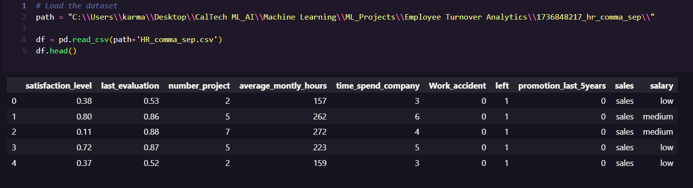

### 4. Data Quality Checks
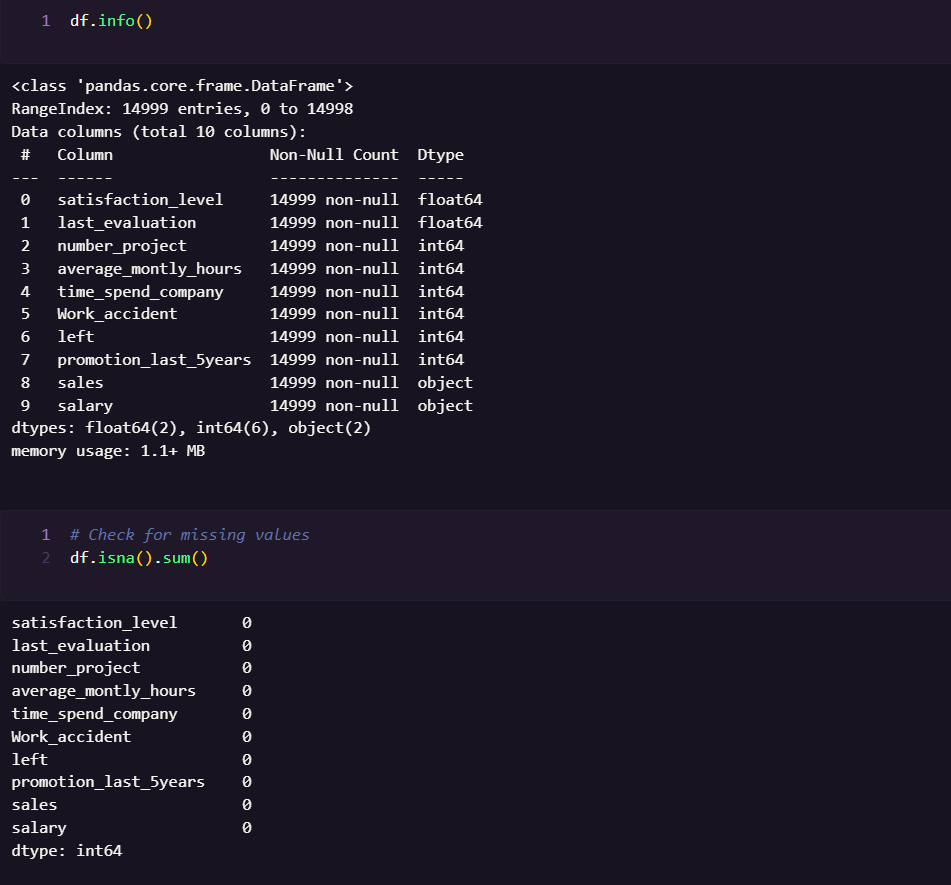

### 5. Correlation Heatmap
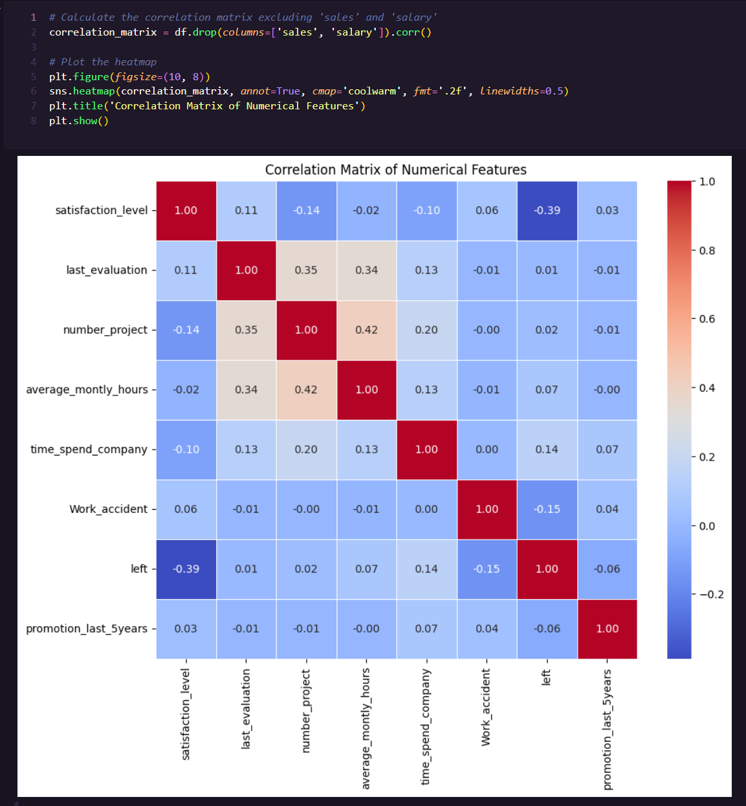

### 6. Employee Turnover Distribution
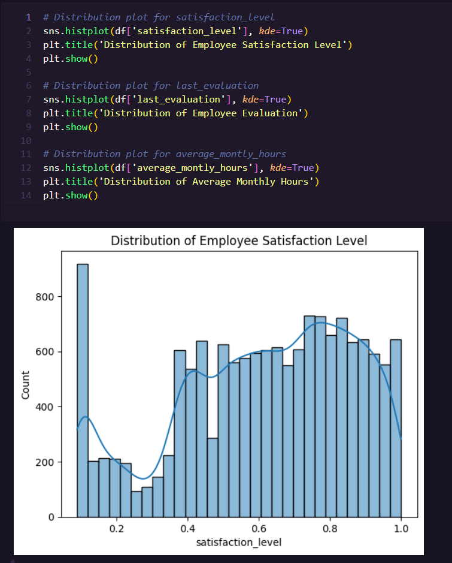
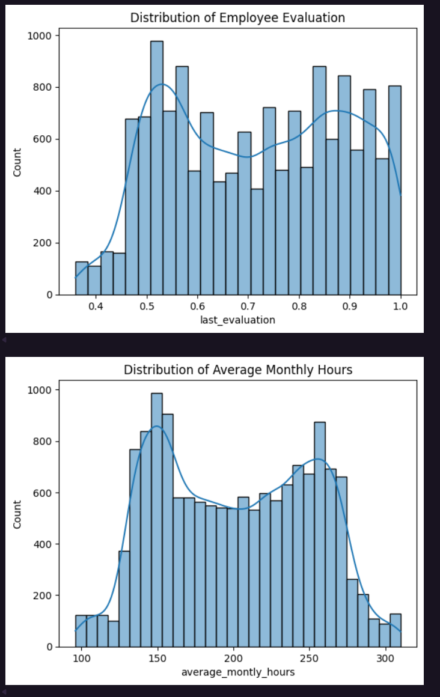

### 7. KMeans Clustering
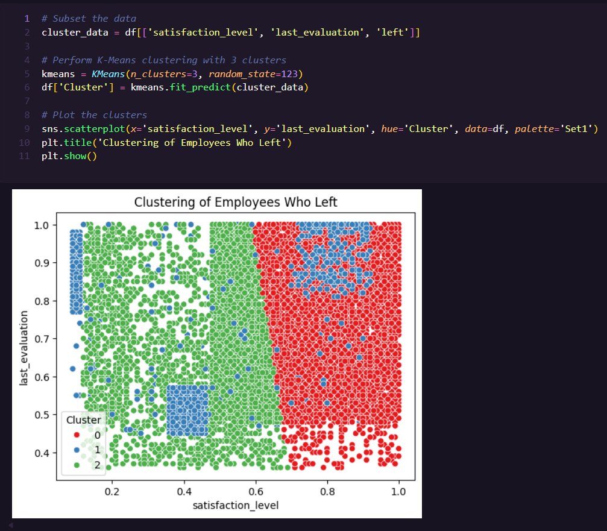

### 8. SMOTE Class Balancing
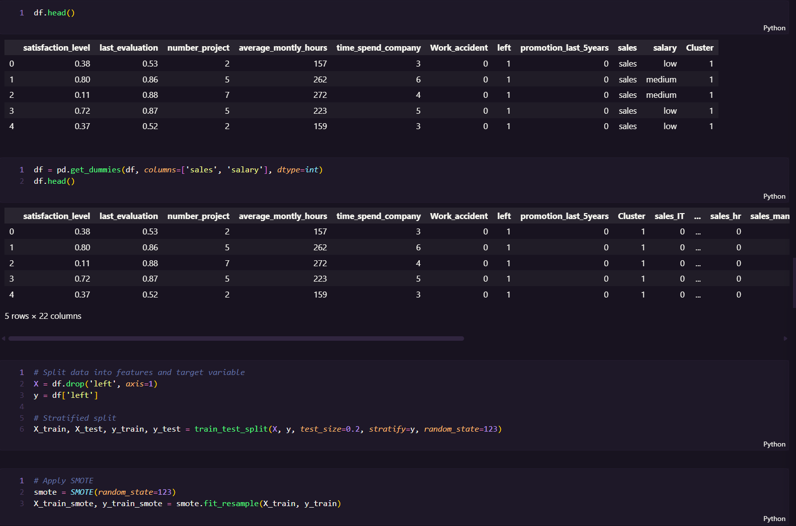

### 9. Model Comparison Results
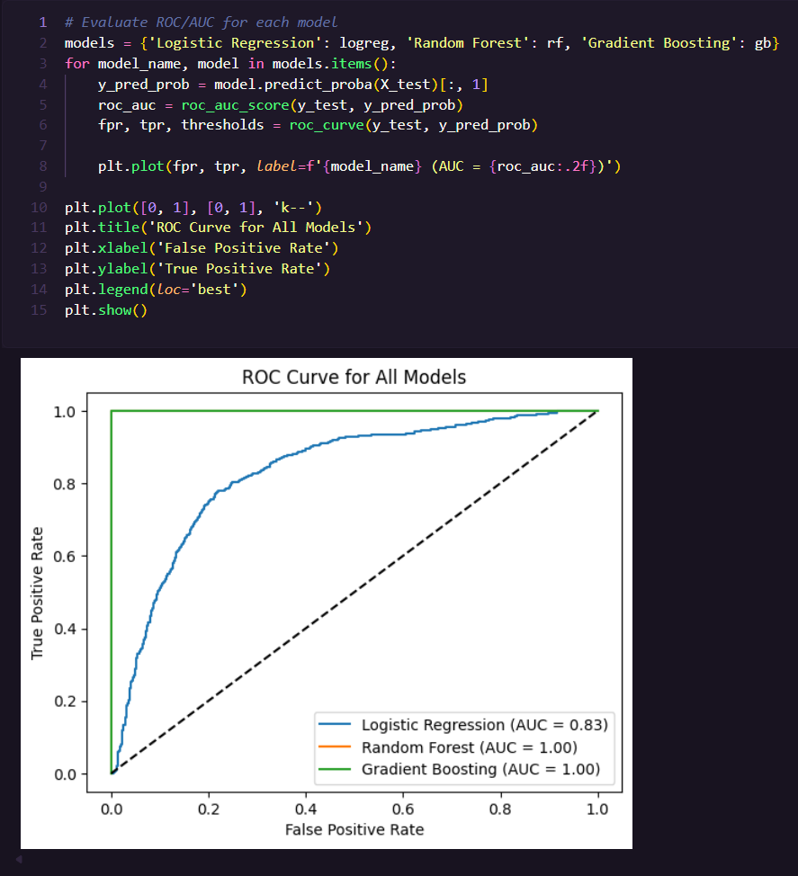

### 10. Risk Zone Retention Strategy
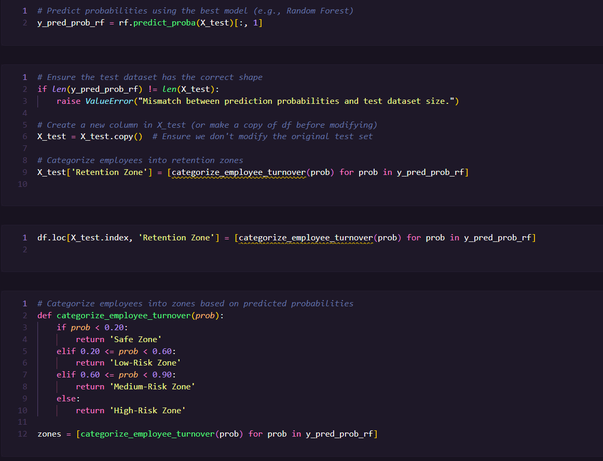
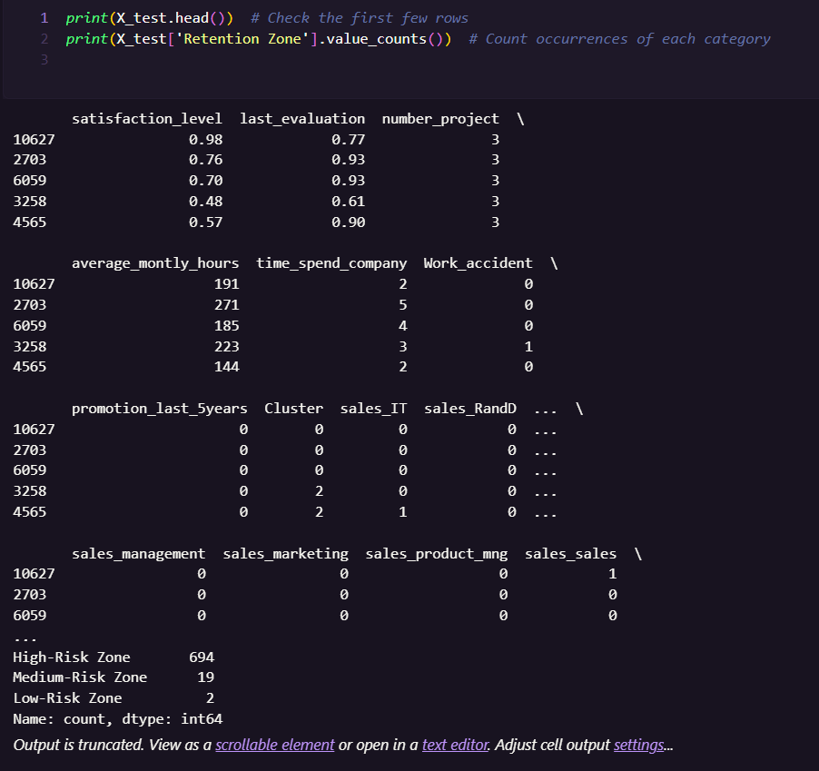
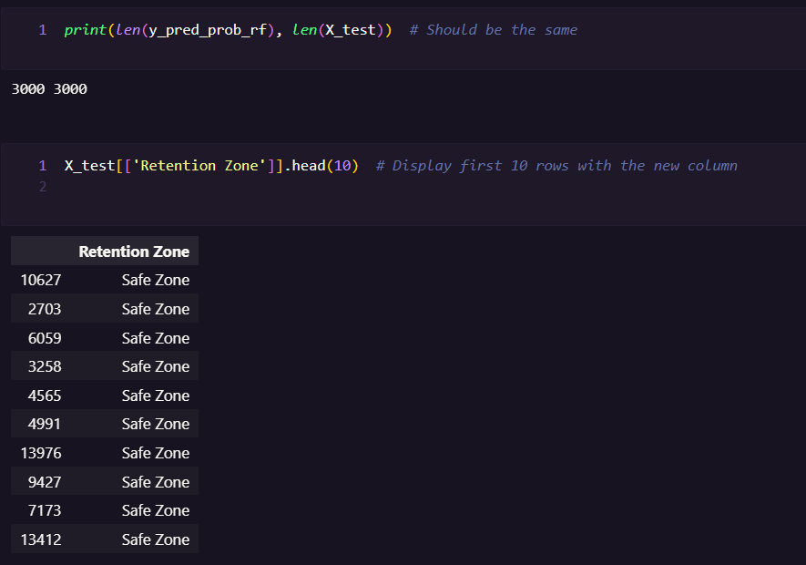

## Model Results

- Compared Logistic Regression, Random Forest, and Gradient Boosting
- Evaluated using accuracy, precision, recall, F1-score, and ROC-AUC
- Identified the most effective model for predicting employee attrition

## What Employers Should Notice

- End-to-end machine learning workflow
- Data preprocessing and EDA skills
- Handling imbalanced datasets using SMOTE
- Model comparison and evaluation techniques
- Translating ML results into business insights
- Clean, professional project documentation

## Business Value

This project demonstrates how machine learning can be applied to reduce employee turnover by identifying high-risk employees and enabling proactive retention strategies.

## Lessons Learned

- Importance of data preprocessing and feature engineering
- Handling imbalanced datasets
- Model selection and evaluation tradeoffs
- Bridging the gap between technical results and business decisions

## Future Improvements

- Deploy as a web application
- Add real-time prediction interface
- Integrate with HR systems
- Enhance feature engineering

## Disclaimer

This project is for educational and portfolio purposes only.
